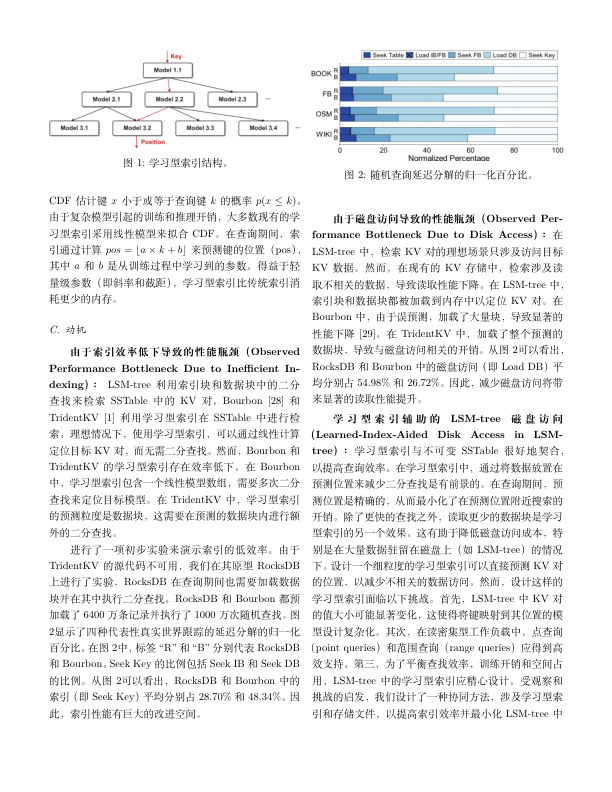

# DeepThesis - 您的智能学术论文翻译与排版神器 🎓✨

[](https://github.com/YOUR_USERNAME/DeepThesis) [](https://www.python.org/) [](https://opensource.org/licenses/MIT)

> 告别英文阅读壁垒，一键将PDF学术论文精准翻译为中文，完美复现原始排版！
> DeepThesis 旨在成为科研工作者、学生和学者的得力助手，让您专注于学术内容本身，而非繁琐的翻译与排版工作。

---

## 🌟 项目亮点

*   **🚀 专业级AI翻译**：深度整合先进翻译引擎，确保术语精准，忠实传达原文语义，智能处理公式符号与文献引用格式。
*   **📐 精准排版还原**：不再为格式错乱烦恼！自动识别并完美重现原文的章节结构、图片位置、表格样式、公式呈现及参考文献布局。
*   **💡 一键化操作**：极致简化用户流程，只需输入待翻译的英文PDF，即可轻松获得高质量的中文PDF及可供二次编辑的LaTeX源码。
*   **🖼️ 智能图片提取**：自动从源PDF中批量提取所有图片（如图表、插图），并无缝嵌入到翻译后的LaTeX文档中相应位置。

---

## 🎯 为什么选择 DeepThesis？

*   **节省时间，提高效率**：将您从繁琐的逐句翻译和手动调格式中解放出来，数倍提升文献阅读和处理效率。
*   **降低阅读门槛**：对于非英语母语的研究者，快速获得母语版本的论文能极大加速对前沿科技的理解和吸收。
*   **保留学术严谨性**：特别针对学术场景优化，确保翻译的专业性和排版的规范性。
*   **开放源码，自由定制**：您可以根据自己的需求进一步开发和优化。

---

## 🛠️ 环境依赖

为了顺利运行 DeepThesis，请确保您的系统中已安装以下环境：

*   **TexLive**: LaTeX 发行版，用于编译生成最终的PDF。
    *   *推荐完整安装以避免缺少宏包。*
*   **Java**: 运行环境（推荐 JDK 8 或更高版本）。
    *   *某些PDF处理库可能需要。*
*   **Python**: 脚本语言环境（推荐 Python 3.8 或更高版本）。
*   **uv**: 高效的 Python 包管理工具 (或 pip)。

---

## 🚀 快速开始

### 1. 环境准备 (以 Arch Linux 为例)

```bash
# 安装核心依赖
sudo pacman -S uv texlive-most jdk-openjdk 

```

### 2. 安装 Python 依赖

克隆本项目到本地后，在项目根目录下运行：

```bash
uv sync
```

### 3. 运行 DeepThesis

核心功能是翻译PDF并提取图片：

```bash
uv run main.py -i <你的英文论文.pdf> -o <翻译后输出路径> --api_key <你的翻译服务API_KEY>
```

**参数说明:**

*   `-i <INPUT_PATH>`: 必需，指定待翻译的英文PDF文件路径。
*   `-o <OUTPUT_PATH>`: 必需，指定翻译后文件（LaTeX源码文件夹和中文PDF）的输出目录。
*   `--api_key <API_KEY>`: 必需，指定您所使用的翻译服务的API密钥(目前仅支持Gemini)。

**输出内容:**

执行完毕后，在您指定的 `<OUTPUT_PATH>` 目录下，您会找到：

1.  一个包含所有LaTeX源码、提取图片和相关配置文件的文件夹。
2.  一个编译好的中文PDF论文。

---

## ✨ 效果预览


*   
*   


---

## 🤝 如何贡献

我们欢迎各种形式的贡献，包括但不限于：

*   提交 Bug 报告
*   贡献代码，修复 Bug 或实现新功能
*   完善文档
*   分享使用经验

如果您有任何想法或建议，请随时通过 [Issues](https://github.com/YOUR_USERNAME/DeepThesis/issues) 与我们交流！

---
